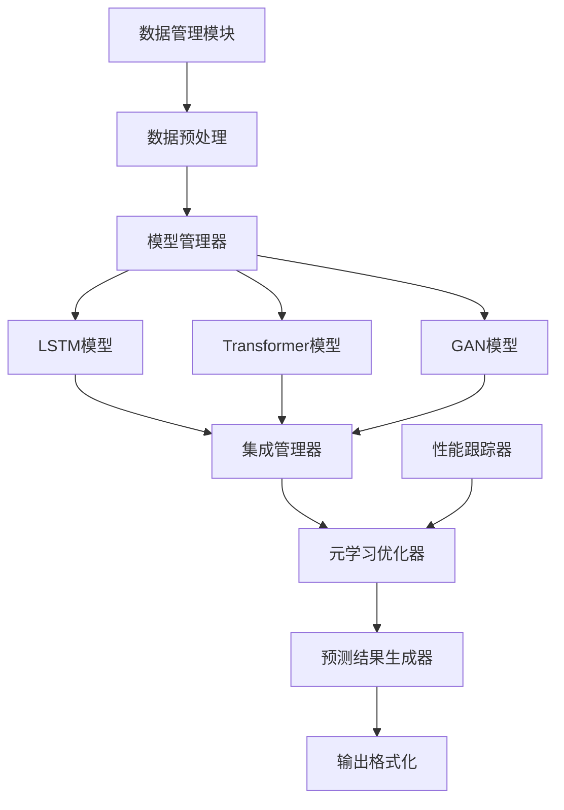

# 设计文档

## 概述

增强深度学习模块旨在通过实现先进的神经网络架构和集成技术，显著提高大乐透智能预测系统的预测准确性。本设计文档详细说明了如何扩展现有的基于LSTM的预测能力，引入最先进的深度学习模型（包括Transformer网络和生成对抗网络GAN），同时实现元学习框架以动态优化模型选择和超参数。

## 架构

### 整体架构

增强深度学习模块将作为现有预测器模块的扩展，保持与现有系统的兼容性，同时提供更强大的预测能力。整体架构如下：



### 核心组件

1. **模型管理器**：负责加载、初始化和管理各种深度学习模型
2. **集成管理器**：实现不同模型预测结果的加权组合和堆叠集成
3. **元学习优化器**：跟踪模型性能并动态调整模型权重和超参数
4. **性能跟踪器**：记录和分析各模型的预测性能
5. **预测结果生成器**：基于集成和元学习结果生成最终预测

## 组件和接口

### 1. 高级神经网络模型

#### Transformer模型

```python
class TransformerPredictor(BasePredictor):
    """基于Transformer架构的预测器"""
    
    def __init__(self, config: Dict[str, Any] = None):
        """
        初始化Transformer预测器
        
        Args:
            config: 配置参数字典，包含模型参数
        """
        self.model = None
        self.config = config or DEFAULT_TRANSFORMER_CONFIG
        self._build_model()
        
    def _build_model(self) -> None:
        """构建Transformer模型"""
        # 实现Transformer模型构建逻辑
        
    def train(self, data: pd.DataFrame, periods: int = 1000) -> None:
        """训练模型"""
        # 实现训练逻辑，包括早停和学习率调度
        
    def predict(self, count: int = 5) -> List[Tuple[List[int], List[int]]]:
        """生成预测结果"""
        # 实现预测逻辑
        
    def get_confidence(self) -> float:
        """获取预测置信度"""
        # 实现置信度计算
```

#### GAN模型

```python
class GANPredictor(BasePredictor):
    """基于GAN架构的预测器"""
    
    def __init__(self, config: Dict[str, Any] = None):
        """
        初始化GAN预测器
        
        Args:
            config: 配置参数字典，包含模型参数
        """
        self.generator = None
        self.discriminator = None
        self.config = config or DEFAULT_GAN_CONFIG
        self._build_model()
        
    def _build_model(self) -> None:
        """构建GAN模型"""
        # 实现GAN模型构建逻辑
        
    def train(self, data: pd.DataFrame, periods: int = 1000) -> None:
        """训练模型"""
        # 实现训练逻辑
        
    def predict(self, count: int = 5) -> List[Tuple[List[int], List[int]]]:
        """生成预测结果"""
        # 实现预测逻辑
        
    def get_confidence(self) -> float:
        """获取预测置信度"""
        # 实现置信度计算
```

### 2. 集成管理器

```python
class EnsembleManager:
    """深度学习模型集成管理器"""
    
    def __init__(self, models: List[BasePredictor] = None):
        """
        初始化集成管理器
        
        Args:
            models: 预测器模型列表
        """
        self.models = models or []
        self.weights = None
        self._initialize_weights()
        
    def _initialize_weights(self) -> None:
        """初始化模型权重"""
        # 实现权重初始化逻辑
        
    def add_model(self, model: BasePredictor) -> None:
        """添加模型到集成"""
        # 实现模型添加逻辑
        
    def weighted_average(self, predictions: List[List[Tuple[List[int], List[int]]]]) -> List[Tuple[List[int], List[int]]]:
        """加权平均预测结果"""
        # 实现加权平均逻辑
        
    def stacked_ensemble(self, predictions: List[List[Tuple[List[int], List[int]]]]) -> List[Tuple[List[int], List[int]]]:
        """堆叠集成预测结果"""
        # 实现堆叠集成逻辑
        
    def get_model_contributions(self) -> Dict[str, float]:
        """获取各模型贡献度"""
        # 实现贡献度计算逻辑
        
    def get_confidence_intervals(self, predictions: List[Tuple[List[int], List[int]]]) -> List[Tuple[float, float]]:
        """获取预测结果的置信区间"""
        # 实现置信区间计算逻辑
```

### 3. 元学习框架

```python
class MetaLearningOptimizer:
    """元学习优化器"""
    
    def __init__(self, models: List[BasePredictor], history_size: int = 50):
        """
        初始化元学习优化器
        
        Args:
            models: 预测器模型列表
            history_size: 历史性能记录大小
        """
        self.models = models
        self.history_size = history_size
        self.performance_history = {}
        self._initialize_history()
        
    def _initialize_history(self) -> None:
        """初始化性能历史记录"""
        # 实现历史记录初始化逻辑
        
    def update_performance(self, model_id: str, metrics: Dict[str, float]) -> None:
        """更新模型性能指标"""
        # 实现性能更新逻辑
        
    def adjust_weights(self) -> Dict[str, float]:
        """调整模型权重"""
        # 实现权重调整逻辑
        
    def should_retrain(self, model_id: str) -> bool:
        """判断模型是否需要重新训练"""
        # 实现重训判断逻辑
        
    def get_explanation(self) -> Dict[str, Any]:
        """获取模型选择决策解释"""
        # 实现决策解释逻辑
```

### 4. 训练数据管理

```python
class DeepLearningDataManager:
    """深度学习训练数据管理器"""
    
    def __init__(self, data_manager: DataManager):
        """
        初始化数据管理器
        
        Args:
            data_manager: 核心数据管理器实例
        """
        self.data_manager = data_manager
        self.cache_manager = CacheManager()
        
    def get_training_window(self, window_size: int = 1000) -> pd.DataFrame:
        """获取指定窗口大小的训练数据"""
        # 实现窗口数据获取逻辑
        
    def incremental_update(self, new_data: pd.DataFrame) -> pd.DataFrame:
        """增量更新训练数据"""
        # 实现增量更新逻辑
        
    def normalize_data(self, data: pd.DataFrame) -> pd.DataFrame:
        """数据标准化处理"""
        # 实现标准化逻辑
        
    def augment_data(self, data: pd.DataFrame) -> pd.DataFrame:
        """数据增强处理"""
        # 实现数据增强逻辑
        
    def detect_anomalies(self, data: pd.DataFrame) -> Tuple[pd.DataFrame, pd.DataFrame]:
        """检测并处理异常数据"""
        # 实现异常检测逻辑
```

### 5. 性能优化管理器

```python
class PerformanceOptimizer:
    """深度学习性能优化管理器"""
    
    def __init__(self):
        """初始化性能优化管理器"""
        self.gpu_available = self._check_gpu()
        self.resource_usage = {}
        
    def _check_gpu(self) -> bool:
        """检查GPU可用性"""
        # 实现GPU检查逻辑
        
    def enable_gpu_acceleration(self, model: Any) -> Any:
        """启用GPU加速"""
        # 实现GPU加速逻辑
        
    def batch_process(self, func: Callable, inputs: List[Any], batch_size: int = 32) -> List[Any]:
        """批处理实现"""
        # 实现批处理逻辑
        
    def quantize_model(self, model: Any) -> Any:
        """模型量化"""
        # 实现模型量化逻辑
        
    def cache_intermediate_results(self, key: str, result: Any) -> None:
        """缓存中间结果"""
        # 实现缓存逻辑
        
    def monitor_resources(self) -> Dict[str, float]:
        """监控资源使用情况"""
        # 实现资源监控逻辑
```

### 6. CLI集成

```python
class DeepLearningCommands:
    """深度学习CLI命令集成"""
    
    def __init__(self, cli_manager):
        """
        初始化CLI命令管理器
        
        Args:
            cli_manager: CLI管理器实例
        """
        self.cli_manager = cli_manager
        self._register_commands()
        
    def _register_commands(self) -> None:
        """注册CLI命令"""
        # 实现命令注册逻辑
        
    def handle_train_command(self, args: argparse.Namespace) -> None:
        """处理训练命令"""
        # 实现训练命令处理逻辑
        
    def handle_predict_command(self, args: argparse.Namespace) -> None:
        """处理预测命令"""
        # 实现预测命令处理逻辑
        
    def handle_ensemble_command(self, args: argparse.Namespace) -> None:
        """处理集成命令"""
        # 实现集成命令处理逻辑
        
    def handle_meta_command(self, args: argparse.Namespace) -> None:
        """处理元学习命令"""
        # 实现元学习命令处理逻辑
```

## 数据模型

### 1. 模型配置数据结构

```python
DEFAULT_TRANSFORMER_CONFIG = {
    "num_layers": 4,
    "d_model": 128,
    "num_heads": 8,
    "dff": 512,
    "input_seq_length": 20,
    "dropout_rate": 0.1,
    "learning_rate": 0.001,
    "batch_size": 64,
    "epochs": 100,
    "early_stopping_patience": 10
}

DEFAULT_GAN_CONFIG = {
    "generator_layers": [128, 256, 128],
    "discriminator_layers": [128, 64, 32],
    "latent_dim": 100,
    "learning_rate": 0.0002,
    "beta1": 0.5,
    "batch_size": 64,
    "epochs": 200,
    "noise_std": 0.1
}
```

### 2. 性能指标数据结构

```python
class ModelPerformanceMetrics:
    """模型性能指标数据结构"""
    
    def __init__(self):
        """初始化性能指标"""
        self.hit_rates = []  # 命中率历史
        self.accuracies = []  # 准确率历史
        self.confidence_scores = []  # 置信度历史
        self.resource_usage = []  # 资源使用历史
        self.prediction_times = []  # 预测时间历史
        
    def add_metrics(self, metrics: Dict[str, float]) -> None:
        """添加性能指标"""
        # 实现指标添加逻辑
        
    def get_average_metrics(self, window: int = None) -> Dict[str, float]:
        """获取平均性能指标"""
        # 实现平均指标计算逻辑
        
    def get_trend(self, metric_name: str) -> List[float]:
        """获取指标趋势"""
        # 实现趋势计算逻辑
```

## 错误处理

### 1. 异常类型定义

```python
class ModelInitializationError(Exception):
    """模型初始化错误"""
    pass

class TrainingDataError(Exception):
    """训练数据错误"""
    pass

class PredictionError(Exception):
    """预测过程错误"""
    pass

class ResourceAllocationError(Exception):
    """资源分配错误"""
    pass

class ModelCompatibilityError(Exception):
    """模型兼容性错误"""
    pass
```

### 2. 错误处理策略

1. **模型初始化错误**：尝试使用备用配置，如果仍然失败则回退到基础模型
2. **训练数据错误**：记录错误并尝试使用缓存的上一版本数据
3. **预测错误**：记录错误并回退到更简单的模型进行预测
4. **资源分配错误**：降低批处理大小或禁用GPU加速
5. **模型兼容性错误**：尝试转换数据格式，如果失败则记录错误并跳过不兼容的模型

## 测试策略

### 1. 单元测试

为每个主要组件编写单元测试，包括：

1. 模型构建和初始化测试
2. 数据预处理和增强测试
3. 预测功能测试
4. 集成方法测试
5. 元学习优化器测试

### 2. 集成测试

1. 端到端预测流程测试
2. 与现有系统集成测试
3. CLI命令测试
4. 性能优化测试

### 3. 性能测试

1. 模型训练性能测试（时间和资源使用）
2. 预测性能测试（准确率和速度）
3. 批处理性能测试
4. GPU加速效果测试

### 4. 回归测试

1. 与基准模型比较测试
2. 历史数据回测
3. 增量更新测试

## 实现计划

实现将分为以下几个阶段：

1. **基础架构实现**：创建基本类和接口
2. **Transformer模型实现**：实现和测试Transformer预测器
3. **GAN模型实现**：实现和测试GAN预测器
4. **集成管理器实现**：实现模型集成功能
5. **元学习框架实现**：实现性能跟踪和优化
6. **性能优化实现**：实现GPU加速和批处理
7. **CLI集成实现**：实现命令行接口
8. **测试和调优**：全面测试和性能调优